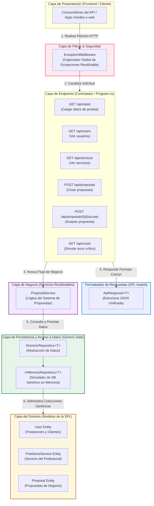

# Actividad 1: Preparación de Componentes Reutilizables y Refactorización
## Línea de Productos de Software (SPL) - Plataforma de Servicios Freelance con Sistema de Propuestas
**Estudiante:** Julian Joel Rueda Flores  
**Asignatura:** Software II  
**Tecnología:** ASP.NET Core Web API (Slim AOT-ready, .NET 8/10)

---

## 1. Introducción y Contexto de la Línea de Producto (SPL)

En la **Ingeniería de Líneas de Productos de Software (Software Product Lines - SPL)**, el objetivo principal es desarrollar un conjunto de sistemas de software que comparten un conjunto común de características gestionadas y se construyen a partir de un conjunto común de activos clave de manera predeterminada.

Para la **Plataforma de Servicios Freelance**, consideramos que la plataforma principal (Marketplace donde profesionales ofrecen servicios con sistema de propuestas) puede variar según los nichos de negocio:
- **Variante A:** Marketplace para Freelance de TI y Programación.
- **Variante B:** Marketplace para Freelance de Diseño y Arte Digital.
- **Variante C:** Marketplace para Traductores e Intérpretes.

Para lograr que estas variantes compartan el mismo núcleo sin duplicar código, identificamos componentes candidatos a la reutilización y aplicamos técnicas rigurosas de diseño y refactorización.

---

## 2. Identificación de Componentes Candidatos a la Reutilización

Dentro de esta línea de producto, se identificaron los siguientes componentes estratégicos para formar parte de la **Plataforma Core Reutilizable (Core Assets)**:

| Componente | Tipo | Propósito en la SPL | Justificación de Reutilización |
| :--- | :--- | :--- | :--- |
| **Envoltura de Respuesta (`ApiResponse<T>`)** | Utilidad / Estructura | Unifica la salida JSON de todas las variantes del API. | Garantiza que cualquier cliente frontend consuma una estructura idéntica (`Success`, `Message`, `Data`, `Errors`) sin importar la variante. |
| **Middleware de Excepciones (`ExceptionMiddleware`)** | Filtro / Infraestructura | Intercepta errores unificadamente a nivel HTTP. | Evita fugas de trazas de pila (stacktrace) y proporciona respuestas de error coherentes formateadas con `ApiResponse`. |
| **Patrón Repositorio Genérico (`IGenericRepository<T>`)** | Acceso a Datos | Abstrae las operaciones CRUD fundamentales del motor de persistencia. | Permite a las variantes de la SPL intercambiar fácilmente la base de datos (SQL Server, SQLite, MongoDB o base de datos en memoria) sin cambiar el código de los servicios. |
| **Validador de Elegibilidad de Freelancers** | Servicio de Dominio | Verifica si un usuario cumple las reglas para ofertar (perfil completo, rating mínimo, cuenta activa). | La lógica básica es compartida por todas las plataformas, aunque los límites de rating y completitud pueden parametrizarse en cada variante de la SPL. |

---

## 3. Diseño e Implementación de los 3 Componentes Reutilizables

Hemos diseñado e implementado con éxito tres componentes listos para producción en el proyecto:

### Componente 1: Envoltura de Respuesta Genérica Estándar (`ApiResponse<T>`)
- **Ubicación:** `Utils/ApiResponse.cs`
- **Diseño:** Implementa genéricos de C# (`T`) para envolver cualquier tipo de respuesta (listas de entidades, objetos unitarios o valores vacíos). Proporciona métodos de conveniencia estáticos como `Ok` y `Fail` para simplificar la escritura de controladores o endpoints minimalistas.
- **Implementación Clave:**
```csharp
public class ApiResponse<T>
{
    public bool Success { get; set; }
    public string Message { get; set; } = string.Empty;
    public T? Data { get; set; }
    public List<string> Errors { get; set; } = new List<string>();
}
```

### Componente 2: Middleware Global de Excepciones (`ExceptionMiddleware`)
- **Ubicación:** `Middlewares/ExceptionMiddleware.cs.cs`
- **Diseño:** Middleware de ASP.NET Core que actúa como un filtro interceptor global. Atrapa excepciones unhandled de la base de datos o lógica de negocio, escribe una bitácora detallada usando el servicio inyectado de logueo (`ILogger`), y retorna un código HTTP 500 encapsulado dentro de nuestro componente `ApiResponse`.
- **Implementación Clave:**
```csharp
public async Task InvokeAsync(HttpContext context)
{
    try
    {
        await _next(context);
    }
    catch (Exception ex)
    {
        _logger.LogError(ex, "An unhandled exception occurred during request execution.");
        await HandleExceptionAsync(context, ex);
    }
}
```

### Componente 3: Repositorio Genérico en Memoria (`IGenericRepository<T>` y `InMemoryRepository<T>`)
- **Ubicación:** `Services/IGenericRepository.cs` e `InMemoryRepository.cs`
- **Diseño:** Un patrón de diseño modular que desacopla la API del motor de base de datos. Utiliza reflexión para inspeccionar y asignar de manera dinámica la propiedad `Id` de cualquier entidad del dominio (`User`, `FreelanceService`, `Proposal`), simulando operaciones asíncronas (`Task.FromResult`) de inserción, actualización, eliminación y consulta.
- **Implementación Clave:**
```csharp
public interface IGenericRepository<T> where T : class
{
    Task<IEnumerable<T>> GetAllAsync();
    Task<T?> GetByIdAsync(int id);
    Task AddAsync(T entity);
    Task UpdateAsync(T entity);
    Task DeleteAsync(int id);
}
```

---

## 4. Aplicación de Técnicas de Refactorización en `ProposalService.cs`

Para demostrar la capacidad de refactorizar código heredado o prototipos con malos olores de código ("code smells"), creamos un servicio central de negocio: `ProposalService.cs`. A continuación, se detalla el antes, el después y las técnicas aplicadas.

### 4.1. Código Prototipo Antes de la Refactorización (Code Smells Detectados)
El prototipo original presentaba serios problemas de mantenibilidad:
1. **Magic Numbers (Números Mágicos):** Tasas de comisión de la plataforma (`0.15` y `0.10`), límites de precio alto (`1000`), rating mínimo (`3.0`) y estados enteros (`0` para pendiente) estaban hardcodeados directamente en el flujo.
2. **Método Largo y Condicionales Anificados:** La lógica de validación del freelancer (activo, perfil completo, rating) estaba estructurada en 4 niveles de anidación `if-else`. Si el freelancer era inválido, la excepción se arrojaba en ramas lejanas del inicio, dificultando la lectura.
3. **Nombres Crípticos de Variables:** Variables asignadas como `p`, `u`, `s` en lugar de nombres semánticos.

```csharp
// --- PROTOTIPO ORIGINAL SUCIO (VERSIÓN ANTERIOR) ---
public async Task<Proposal> SubmitProposalAsync(Proposal p)
{
    var u = await _userRepository.GetByIdAsync(p.FreelancerId);
    if (u == null) throw new Exception("Freelancer not found");
    
    if (u.IsActive)
    {
        if (u.ProfileCompleted)
        {
            if (u.Rating >= 3.0)
            {
                var s = await _serviceRepository.GetByIdAsync(p.ServiceId);
                if (s == null) throw new Exception("Service not found");

                if (p.ProposedPrice > 1000)
                {
                    p.PlatformFee = p.ProposedPrice * 0.10m;
                }
                else
                {
                    p.PlatformFee = p.ProposedPrice * 0.15m;
                }
                p.NetPayout = p.ProposedPrice - p.PlatformFee;
                p.Status = 0; // ¿Qué significa 0? Pendiente.

                await _proposalRepository.AddAsync(p);
                return p;
            }
            else throw new Exception("Freelancer rating is too low");
        }
        else throw new Exception("Freelancer profile is incomplete");
    }
    else throw new Exception("Freelancer is inactive");
}
```

---

### 4.2. Técnicas de Refactorización Aplicadas

#### Técnica 1: Replace Magic Number (Reemplazar número mágico por constante/enum)
*   **Problema:** Los números `0.15`, `0.10`, `1000` y `0` quitaban claridad. ¿Qué pasa si la comisión de la plataforma cambia? Habría que modificar múltiples archivos.
*   **Solución:** Se crearon constantes semánticas de clase y se sustituyó el entero `0` por el enum fuertemente tipado `ProposalStatus.Pending`.
```csharp
private const decimal StandardCommissionRate = 0.15m;
private const decimal PremiumCommissionRate = 0.10m;
private const decimal HighValueThreshold = 1000.00m;
private const double MinimumFreelancerRating = 3.0;
```

#### Técnica 2: Extract Method (Extraer método)
*   **Problema:** El método `SubmitProposalAsync` hacía tres cosas distintas: buscar entidades en la base de datos, validar reglas del negocio y calcular comisiones financieras de la plataforma. Esto violaba el **Principio de Responsabilidad Única (SRP)**.
*   **Solución:** Se extrajo la validación a `ValidateProposalEligibilityAsync` y el cálculo financiero a `CalculatePlatformFees`.
```csharp
// Método principal limpio
public async Task<Proposal> SubmitProposalAsync(Proposal proposal)
{
    var freelancer = await _userRepository.GetByIdAsync(proposal.FreelancerId);
    var service = await _serviceRepository.GetByIdAsync(proposal.ServiceId);

    await ValidateProposalEligibilityAsync(proposal, freelancer, service);
    CalculatePlatformFees(proposal);

    proposal.Status = ProposalStatus.Pending;
    await _proposalRepository.AddAsync(proposal);
    return proposal;
}
```

#### Técnica 3: Decompose Conditional (Descomponer condicional)
*   **Problema:** La verificación de que un freelancer fuera elegible involucraba evaluar múltiples flags booleanas (`u.IsActive && u.ProfileCompleted && u.Rating >= 3.0`) en cascada, haciendo la expresión densa y confusa.
*   **Solución:** Se extrajo la lógica de elegibilidad a una expresión auxiliar llamada `IsFreelancerEligible`.
```csharp
private bool IsFreelancerEligible(User freelancer)
{
    return freelancer.IsActive && 
           freelancer.ProfileCompleted && 
           freelancer.Rating >= MinimumFreelancerRating;
}
```

---

### 4.3. Código Refactorizado Resultante (Limpio y Robusto)
El código final en producción quedó estructurado de la siguiente forma en `Services/ProposalService.cs`:
```csharp
public async Task<Proposal> SubmitProposalAsync(Proposal proposal)
{
    var freelancer = await _userRepository.GetByIdAsync(proposal.FreelancerId);
    var service = await _serviceRepository.GetByIdAsync(proposal.ServiceId);

    await ValidateProposalEligibilityAsync(proposal, freelancer, service);
    CalculatePlatformFees(proposal);

    proposal.Status = ProposalStatus.Pending;
    proposal.CreatedAt = DateTime.UtcNow;

    await _proposalRepository.AddAsync(proposal);
    return proposal;
}

private async Task ValidateProposalEligibilityAsync(Proposal proposal, User? freelancer, FreelanceService? service)
{
    if (freelancer == null) throw new ArgumentException("The specified freelancer does not exist.");
    if (service == null) throw new ArgumentException("The specified service does not exist.");

    if (!IsFreelancerEligible(freelancer))
    {
        throw new InvalidOperationException("The freelancer is not eligible to submit proposals.");
    }
    if (proposal.ProposedPrice <= 0) throw new ArgumentException("The proposed price must be greater than zero.");
}

private void CalculatePlatformFees(Proposal proposal)
{
    decimal commissionRate = proposal.ProposedPrice >= HighValueThreshold 
        ? PremiumCommissionRate 
        : StandardCommissionRate;

    proposal.PlatformFee = proposal.ProposedPrice * commissionRate;
    proposal.NetPayout = proposal.ProposedPrice - proposal.PlatformFee;
}
```

---

## 5. Justificación Técnica de las Decisiones de Diseño

Estas refactorizaciones y diseños tienen sólidas justificaciones bajo la ingeniería de software:

1.  **Alta Cohesión y Bajo Acoplamiento (SRP):** Al delegar los cálculos a métodos específicos (`CalculatePlatformFees`) y la validación a (`ValidateProposalEligibilityAsync`), cada sección del código hace exactamente una sola cosa. Si en el futuro la fórmula de cobro cambia, solo se modifica la lógica interna de ese método sin alterar el flujo principal de propuestas.
2.  **Sustituibilidad (Principio de Abstracción):** El uso de interfaces (`IGenericRepository<T>`) permite que cualquier servicio de la plataforma dependa de abstracciones. Si cambiamos nuestra persistencia de memoria local a una base de datos PostgreSQL, no es necesario reescribir ni una sola línea de código en `ProposalService.cs`.
3.  **Mantenibilidad de la Software Product Line (SPL):** Al estructurar el API con respuestas estandarizadas (`ApiResponse<T>`) y control global de errores, cualquier desarrollador que cree una variante del negocio (ej. "Marketplace de Diseñadores") hereda esta consistencia por defecto, reduciendo el "Time-to-Market" de la nueva variante de la línea de producto.

---

## 6. Diagrama de la Arquitectura de los Componentes

A continuación, se presenta la arquitectura física y lógica del backend desarrollado. El diagrama ilustra cómo fluyen las peticiones HTTP desde el cliente frontend, cómo son protegidas por el middleware reutilizable y cómo interactúan con los servicios de lógica de negocio y acceso a datos reutilizables.



---

## 7. Instrucciones para Ejecutar y Probar la Aplicación

El proyecto compila exitosamente bajo `.NET SDK` (`dotnet build` exitoso con 0 errores).

### Paso 1: Ejecutar la aplicación en modo desarrollo
Desde la terminal en el directorio raíz del proyecto:
```bash
dotnet run --project FreelanceMarketplace.API
```

### Paso 2: Sembrar datos de prueba (Seed Database)
Abre tu navegador o cliente HTTP (Postman) y realiza una petición GET a:
`http://localhost:5000/api/seed` (o el puerto HTTPS asignado en la consola).
*   **Respuesta:** Retornará un `ApiResponse` confirmando la inserción en memoria de 4 freelancers (incluyendo uno con bajo rating y otro con perfil incompleto para pruebas), 2 clientes y 2 servicios freelance.

### Paso 3: Probar creación de propuestas y validaciones (Refactorización en acción)
Haz una petición POST a `/api/proposals` con los siguientes escenarios de prueba:

*   **Caso A: Propuesta Válida**
    *   **JSON:**
        ```json
        {
          "serviceId": 1,
          "freelancerId": 1,
          "clientId": 5,
          "proposedPrice": 1200.00,
          "estimatedHours": 40,
          "message": "Puedo desarrollar tu ERP en tiempo récord."
        }
        ```
    *   **Comportamiento:** Se valida exitosamente. Al ser el monto mayor a $1000, se aplica automáticamente la tasa de comisión premium del **10%** ($120). NetPayout resulta en $1080. Estatus se guarda como `Pending`.

*   **Caso B: Error por Rating Bajo (Validación de Elegibilidad)**
    *   **JSON:** (Freelancer ID 3 tiene un rating de 2.5, el cual es inferior al mínimo permitido de 3.0)
        ```json
        {
          "serviceId": 1,
          "freelancerId": 3,
          "clientId": 5,
          "proposedPrice": 500.00,
          "estimatedHours": 10,
          "message": "Cobro barato."
        }
        ```
    *   **Comportamiento:** Retorna un HTTP 400 Bad Request formateado con `ApiResponse` indicando que el freelancer no cumple las condiciones de elegibilidad.

*   **Caso C: Error en Middleware de Excepciones**
    *   **Ruta:** Realiza un GET a `/api/crash`
    *   **Comportamiento:** Intercepta la excepción no controlada y retorna un JSON unificado con HTTP 500, protegiendo al backend de fugas de datos de depuración.
